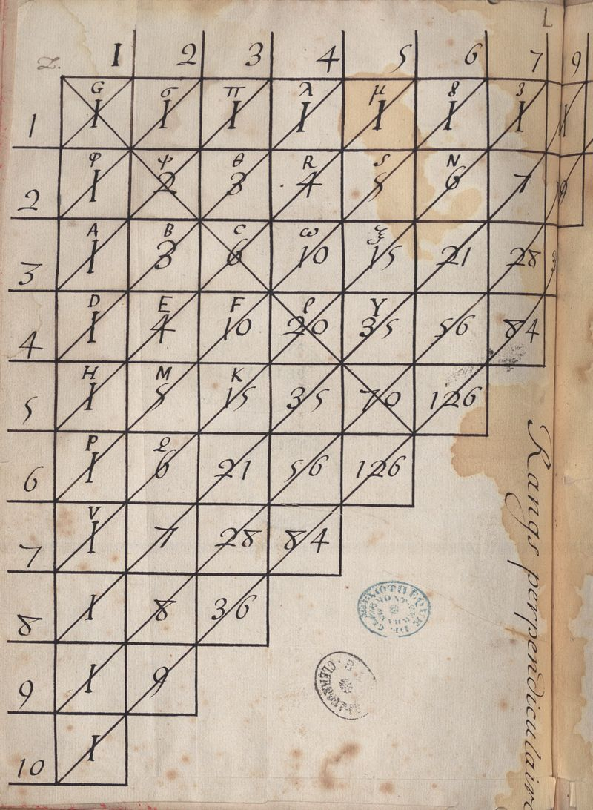

# 2023 Playbook

## Taking into consideration the best Big O notation, time complexity, algorithms

## Goals for v.0.0.2 
* Implement 50 Factorial Functions
* Implement 10 Triangle Functions
* Implement 20 Pascal Triangle Arithmetics, properties
* Implement 100 Sequence Function

1. Implement the major factorial formulae functions
   * [x] Subfactorial
   * [x] Double Factorial
   * [x] Type B Coefficient (Pascal's Triangle Stem)
   * [ ] Triple Factorial

2. Implement the major triangle formulae functions
   * [ ] Pythagoras
   * [ ] Euclid
   * [ ] Thales

3. Implement Pascal Triangle Arithmetic and properties
   * The addition of the horizontal bands: According to Pascal's "Traite dv triangle arithmetiqve"\
    
   * Type B Catalan numbers

4. Implement (non-factorial) sequence functions\
   resources: https://oeis.org
   * [x] Atone sequence (Gauss Binomial Coefficient)
   * [ ] Odds
   * [ ] Evens
